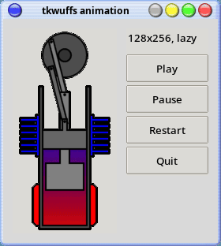

# tclwuffs

Memory-safe image I/O for Tcl/Tk. Decoders from [google/wuffs](https://github.com/google/wuffs);
resize via [`stb_image_resize2`](https://github.com/nothings/stb); PNG encode via
[`stb_image_write`](https://github.com/nothings/stb).

## Load JPEG, BMP, WebP into Tk

Tk 9 ships PNG and GIF. `tkwuffs` plugs the rest into the regular
`image create photo` machinery:

```tcl
package require tkwuffs
image create photo p -file holiday.jpg
image create photo p -data $webp_bytes
```

PNG and GIF still go through Tk's built-in handlers. To force a PNG through
wuffs anyway, call `::tkwuffs::decode_to_photo` directly.

## Animation



```tcl
package require tkwuffs
::tkwuffs::animation p -file holiday.gif
pack [label .l -image p]
::tkwuffs::play p
```

The animation is bound to the photo; deleting the photo tears it down. Lazy
decode by default; `-cache eager` pre-renders all frames.

## Two packages

- **`tclwuffs`** — bytes in, bytes out. Plain `tclsh`.
- **`tkwuffs`** — Tk `photo` bridge plus the format hooks above and animation.

## Build

```sh
make            # tclwuffs (+ tkwuffs if Tk is detected)
make test
make smoke      # direct C-API smoke binary
make clean
```

Vendored sources live under `vendor/`. The Makefile picks up `TCL_INCLUDE`,
`TCL_STUB_LIB`, `TK_INCLUDE`, `TK_STUB_LIB` when set — that's how
[zippy](https://github.com/pounceandmiss/zippy) drives static embedding.
Otherwise it sources `tclConfig.sh`/`tkConfig.sh` from the usual locations;
override with `TCLCONFIG=`/`TKCONFIG=`.

Each tier builds both `.so` and `.a`. The static `libtkwuffs.a` holds only the
Tk binding objects, so link both when embedding.

## API

All commands raise Tcl errors with `-errorcode {TCLWUFFS <CATEGORY> ...}`. See
[Errors](#errors).

### tclwuffs

#### `::tclwuffs::sniff $bytes`

Returns `png`, `jpeg`, `gif`, `bmp`, `webp`, or `""` for unknown. Never raises.

#### `::tclwuffs::decode $bytes`

Decodes to packed RGBA. Returns a dict `{width W height H pixels P}` where `P`
is `W*H*4` bytes (straight alpha, top-down). Animated inputs return frame 0;
use `decoder` for the rest.

Supported: PNG, JPEG, GIF, BMP, WebP (lossless only until google/wuffs PR #168
lands).

#### `::tclwuffs::decoder $bytes`

Streaming multi-frame decoder. Returns a handle:

| Subcommand   | Returns                                                |
|--------------|--------------------------------------------------------|
| `$h info`    | `{width W height H loop_count L}`                      |
| `$h next`    | `{pixels P delay_ms D}` per frame, `""` at end         |
| `$h restart` | rewind to frame 0                                      |
| `$h destroy` | free                                                   |

Frames come fully composed (GIF disposal and per-frame blend resolved
internally). Sub-20ms delays clamp to 100ms. `loop_count 0` means forever.

```tcl
set h [::tclwuffs::decoder $bytes]
while {[set f [$h next]] ne ""} {
    # ...process [dict get $f pixels]...
}
$h destroy
```

#### `::tclwuffs::encode_png $w $h $pixels`

Encodes `$pixels` (exactly `$w*$h*4` RGBA bytes) to PNG.

#### `::tclwuffs::resize_bytes $bytes $w $h ?-filter default|bilinear|bicubic?`

Decode → resize → encode-PNG. Input any supported format; output PNG.

#### `::tclwuffs::crop_bytes $bytes $x $y $w $h`

Decode → crop → encode-PNG. `$x`/`$y` are 0-based top-left. Out-of-bounds rect
raises `INVALID_INPUT`.

### tkwuffs

Loading the package registers the `::tkwuffs::*` commands and installs
`Tk_PhotoImageFormatVersion3` hooks for `jpeg`, `bmp`, and `webp`.

#### `::tkwuffs::decode_to_photo $bytes $photoName`

Decodes into an existing photo, resizing it to match and clearing prior
contents.

#### `::tkwuffs::encode_png_from_photo $photoName`

Returns PNG bytes. 

#### `::tkwuffs::resize_photo $src $dst $w $h ?-filter F?`

Resize `$src` to `$w`×`$h`, write into `$dst`. Same photo for both is fine.

#### `::tkwuffs::crop_photo $src $dst $x $y $w $h`

Crop `$src` to (`$x`,`$y`,`$w`,`$h`), write into `$dst`.

#### `::tkwuffs::animation $photoName -data $bytes | -file $path ?-cache lazy|eager? ?-loops N? ?-onstop CMD?`

Bind an animation to a Tk photo. Exactly one of `-data` or `-file`. Creates
the photo if missing. Does not auto-start; frame 0 renders on first `play`.
Re-calling on an already-animated photo replaces the source and options.

- `-cache lazy` (default): one frame decoded per tick from a kept-alive
  `decoder`. Steady-state memory ~3 frames.
- `-cache eager`: pre-renders every frame into a private photo. Holds
  `N*W*H*4` bytes; tick is one `photo copy`.
- `-loops N` overrides the source loop count. `0` = forever.
- `-onstop CMD` runs at global scope when the loop cap is reached. Not fired
  by `pause`, `restart`, or photo deletion.

#### `::tkwuffs::play $photoName`

Start or resume. No-op if already playing or the loop cap is reached.

#### `::tkwuffs::pause $photoName`

Cancel pending ticks. Current frame stays displayed.

#### `::tkwuffs::restart $photoName`

Rewind to frame 0. Play/pause state preserved.

#### `::tkwuffs::info $photoName`

Dict: `target`, `mode`, `width`, `height`, `iter`, `loops`, `playing`. Eager
mode also includes `frame_count` and `index`. Raises `INVALID_INPUT` if no
animation is bound.

## Errors

```tcl
catch {::tclwuffs::decode "not an image"} msg
puts $::errorCode     ;# -> TCLWUFFS UNSUPPORTED_FORMAT
```

| Category             | Cause                                                            |
|----------------------|------------------------------------------------------------------|
| `INVALID_INPUT`      | bad argument (wrong pixel length, crop rect outside image, etc.) |
| `UNSUPPORTED_FORMAT` | bytes don't match any supported decoder                          |
| `DECODE`             | wuffs rejected the bytes (truncated, bad chunk)                  |
| `ENCODE`             | stb encoder failed                                               |
| `RESIZE`             | stb resize failed                                                |
| `OOM`                | allocation failed                                                |
| `TOO_LARGE`          | dimension exceeds 65535                                          |
| `INTERNAL`           | shouldn't happen; file a bug                                     |

## Pixel layout

Packed RGBA, 8 bits/channel, straight (non-premultiplied) alpha, top-down
rows. Matches Tk 9's photo image, so buffers go to `Tk_PhotoPutBlock` without
reordering.

## Not yet

- Lossy WebP (VP8) — automatic once google/wuffs PR #168 lands
- EXIF orientation auto-rotate
